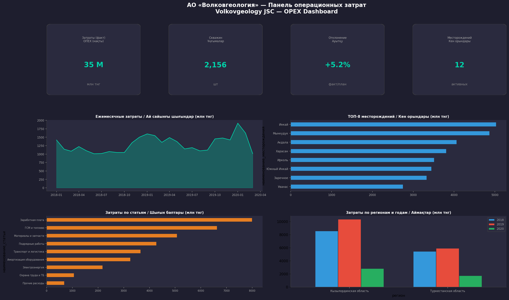
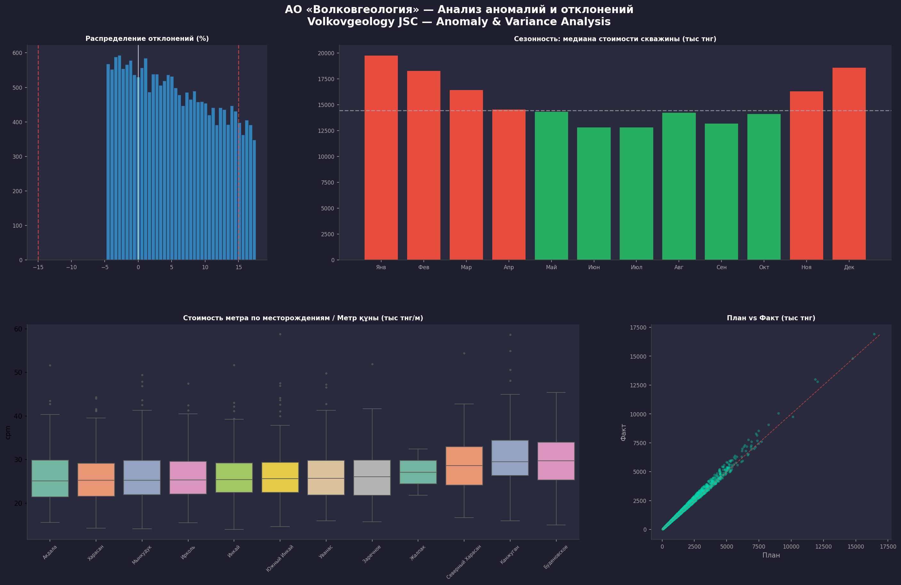

# АО «Волковгеология» — Анализ операционных затрат на буровые работы
# Volkovgeology JSC — Drilling Operations OPEX Analysis

## Описание проекта / Project Overview

Анализ операционных расходов (OPEX) на геологоразведочное и эксплуатационное бурение по месторождениям урана АО «Волковгеология» (дочернее предприятие НАК «Казатомпром») за 2018–2020 гг.

Operational expenditure analysis for exploration and production drilling across uranium deposits of Volkovgeology JSC (a subsidiary of NAC Kazatomprom) for 2018–2020.

**Данные / Data:** 19,404 записи | 2,156 скважин | 12 месторождений | 9 статей затрат

## Основные результаты / Key Findings

- **ТОП-3 статьи затрат / Top 3 cost items:** зарплата (24.8%), ГСМ (18.3%), материалы (14.1%) — 57% всех расходов
- **Сезонность / Seasonality:** зимние месяцы на 20-25% дороже летних (ГСМ, логистика)
- **Аномалии / Anomalies:** ~9% записей с отклонением >15% от плана
- **COVID-19:** Q1 2020 — снижение на 24% скважин, 23% затрат vs Q1 2019
- **Стоимость метра / Cost per meter:** рост ~6% в год, разброс 2-3x между месторождениями
- **Региональный фокус / Regional focus:** Кызылординская область — 60% затрат (7 из 12 месторождений)

## Структура репозитория / Repository Structure
```
├── data/
│   ├── raw/                        # Исходные данные / Raw data
│   │   ├── drilling_operations.csv # Операции бурения
│   │   ├── deposits.csv            # Справочник месторождений
│   │   └── cost_categories.csv     # Справочник статей затрат
│   ├── processed/                  # Обработанные данные / Processed
│   │   ├── opex_summary.csv
│   │   ├── cost_per_meter.csv
│   │   └── anomalies.csv
│   └── sql/                        # SQL запросы
│       ├── 01_проверка_данных.sql
│       └── 02_opex_summary.sql
├── notebooks/
│   ├── 01_eda.ipynb                # Разведочный анализ / EDA
│   └── 02_cost_analysis.ipynb      # Анализ затрат и аномалий
├── src/
│   └── opex_utils.py               # Утилиты / Utility functions
├── reports/
│   ├── executive_summary_ru.md     # Отчёт (русский)
│   ├── қысқаша_есеп.md             # Есеп (қазақша)
│   └── figures/                    # Графики / Visualizations
└── dashboard/
    └── screenshots/                # Power BI скриншоты
```

## Дашборд / Dashboard Preview





## Рекомендации / Recommendations

1. **Пересмотр планирования / Revise planning** — скользящее планирование с ежемесячной корректировкой
2. **Сезонное ценообразование / Seasonal pricing** — фиксация зимних тарифов на ГСМ и транспорт
3. **Аудит аномалий / Anomaly audit** — проверка ТОП-50 скважин с наибольшим перерасходом
4. **Консолидация закупок / Procurement consolidation** — объединение заказов по регионам
5. **Бенчмаркинг / Benchmarking** — целевые KPI стоимости метра по каждому месторождению

## Стек / Stack

- **Python** (pandas, NumPy, seaborn, matplotlib)
- **SQL**
- **Power BI**

## Языки отчётности / Report Languages

- 🇷🇺 Русский — [executive_summary_ru.md](reports/executive_summary_ru.md)
- 🇰🇿 Қазақша — [қысқаша_есеп.md](reports/қысқаша_есеп.md)
- 🇬🇧 English — this README

## Автор / Author

Nurbol Sultanov — Data Analyst (contract via Volkovgeology JSC, Almaty)